# 😭*NCUSCC秋季考核C语言试题实验报告*
作者：赵震杰

开始于2024.10.12

完成于2024.10.22

---

## I. *实验环境的搭建过程*
### 一、**在虚拟机中安装Ubuntu 22.04 LTS操作系统**
1.在VMware官网中下载VMware Workstation Pro并安装。

2.由于在官网为外国网站，所以下载文件会非常缓慢，推荐更换为国内的镜像源下载，这样可以大大提高下载速度。以[清华源](https://mirrors.tuna.tsinghua.edu.cn)为例，我们可以在其中找到<u>ubuntu-releases</u>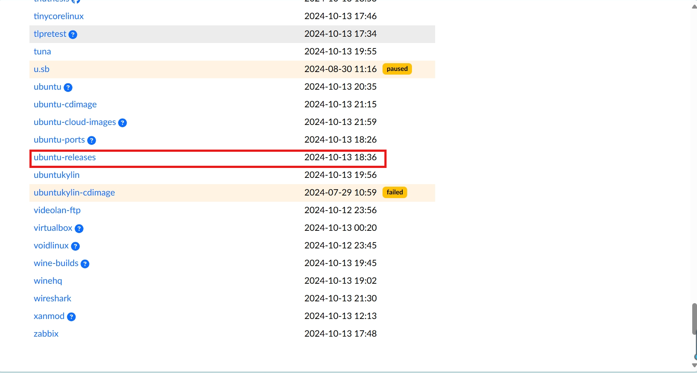点击后选择22.04.5版本，选择[ubuntu-22.04.5-desktop-amd64.iso](https://mirrors.tuna.tsinghua.edu.cn/ubuntu-releases/22.04/ubuntu "ubuntu-22.04.5-desktop-amd64.iso")并点击下载，这就是安装Ubuntu操作系统所需要的镜像文件。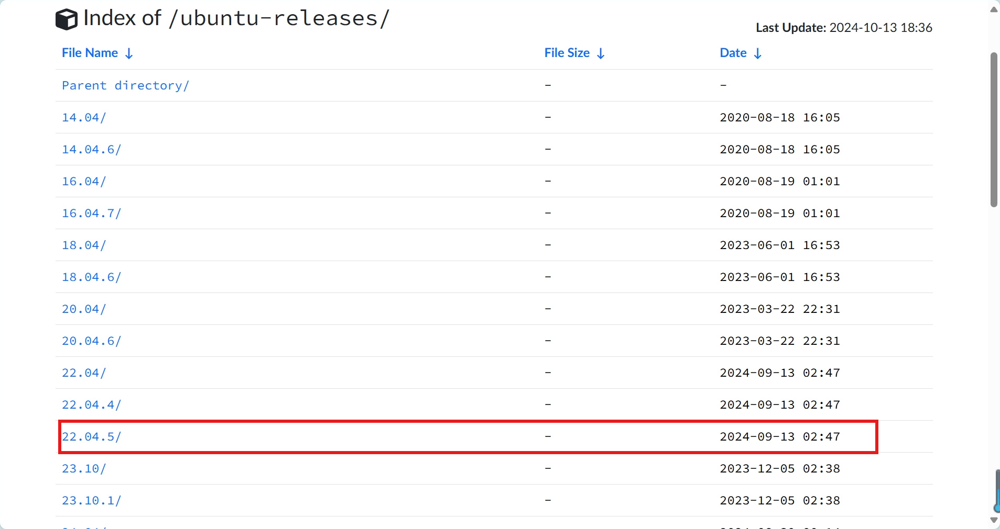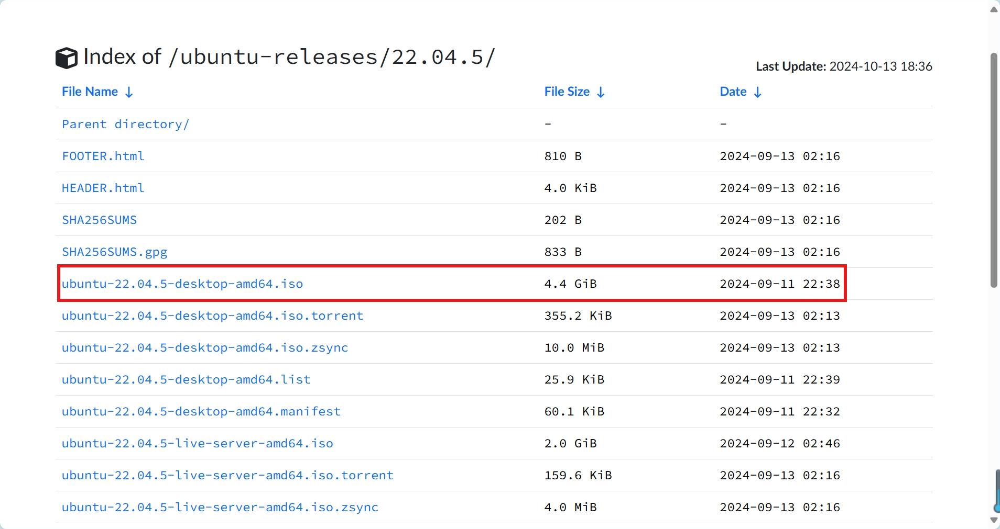

3.打开VMware并新建虚拟机，在自定义模式中选择Linux操作系统并进行相应的配置，具体配置如下：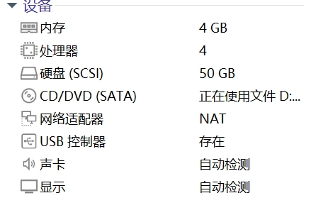

4.点击编辑虚拟机设置，选择<u>CD/DVD(SATA)</u>一栏，选择使用ISO镜像文件，并导入刚刚已下载的ISO镜像文件然后重启虚拟机，然后完成相应的用户创建及基础设置，如此一来，操作系统的安装基本就已经完成了。
### 二、**网络配置**
1.若无特殊需求，在创建虚拟机时使用虚拟机系统默认的NET模式网络连接即可。

### 三、**gcc的安装**

如果需要对C语言代码进行编译以使其可以直接运行，那么功能强大且高效的**gcc**便是不可或缺的。

1. 安装gcc：在虚拟机中打开终端，运行命令下列命令安装gcc编译器：
```sudo apt install gcc g++ build-essential```

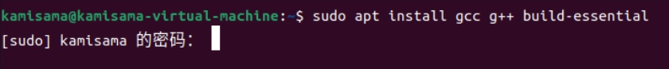

（注：输入密码时不会显示输入的密码，输入完按回车即可）

2. 验证安装：安装完成后，可以通过运行```gcc --version```或```g++ --version```来检查是否成功安装了gcc，还能知晓安装的版本。

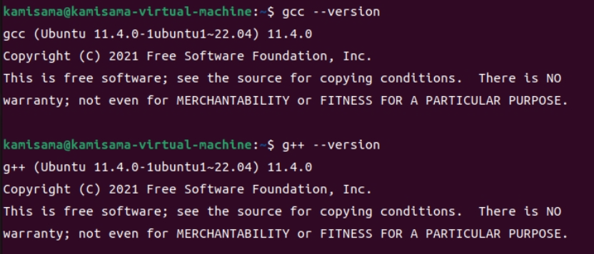

如图显示即代表已经安装成功。
## II. ***实现排序算法***
### 一、**冒泡排序**
冒泡排序是一种简单的排序算法，它通过重复遍历待排序的数列，一次比较两个元素，如果他们的顺序错误就把他们交换过来。遍历数列的工作是重复进行直到没有再需要交换，也就是说该数列已经排序完成。这个算法的名字由来是因为越小的元素会经由交换慢慢“浮”到数列的顶端。

1. **重复遍历待排序的数列**：从第一个元素到第二个再到最后一个元素，每次重复这个过程直到没有需要交换的操作为止。

2. **比较相邻的元素**：在每次遍历后，比较相邻的两个元素，如果前者比后者大，则交换之。

3. **遍历整个数列**：在一趟遍历中，如果发生了交换，说明数列还没有被完全排序，需要进行下一趟遍历。如果没有发生交换，则说明数列已经排序完成。

4. **具体代码** ：[maopao.c](https://github.com/codefashion007/Source-code-and-Experimental-report/blob/master/maopao.c)

### 二、**基础堆排序**
堆排序是一种基于比较的排序算法，其核心思想是利用堆这种数据结构来排序。堆是一个近似完全二叉树的结构，并满足以下性质：
1.  **大顶堆（大根堆）**：每个节点的值都大于或等于其子节点的值。
2.  **小顶堆（小根堆）**：每个节点的值都小于或等于其子节点的值。

堆排序的基本步骤如下：
1.  **建立堆**：将无序序列构造成一个堆，根据升序或降序需求，可以选择大顶堆或小顶堆。
    
2.  **堆调整**：将堆的最后一个非叶子节点调整为最大值（大顶堆）或最小值（小顶堆）。
    
3.  **交换堆顶元素与最后一个元素**：将堆顶元素（最大值或最小值）与序列的最后一个元素进行交换，然后对交换后的堆进行调整，使其满足堆的性质。

4. **重复步骤3**：重复交换和调整堆，直到整个序列有序。

5.  **具体代码**：[dui.c](https://github.com/codefashion007/Source-code-and-Experimental-report/blob/master/dui.c)

### 三、**斐波那契堆排序**
斐波那契堆（Fibonacci Heap）是一种用于实现优先队列的数据结构，它支持一系列操作，包括插入、查找最小值、合并两个堆、提取最小值、减小键值和删除节点。

其基本步骤如下：
1.  **插入操作（Insert）**：
    
    -   创建一个新节点，初始化其度（degree）为0，父节点（parent）为NULL，子节点链表（child）为NULL，左右兄弟指针指向自己，标记（mark）为FALSE。
    -   将新节点添加到根节点列表，并更新最小值指针（min）如果需要。
2.  **查找最小值（GetMin）**：
    
     直接返回指向最小值节点的指针。

3.  **合并两个堆（Union）**：
    
       将两个斐波那契堆的根节点列表连接起来，更新最小值指针。

4.  **提取最小值（ExtractMin）**：
    
    -   移除最小值节点的所有子节点，并将它们添加到根节点列表。
    -   从根节点列表中移除最小值节点，更新最小值指针，可能需要执行堆的合并操作（Consolidate）。

5.  **减小键值（DecreaseKey）**：
    
    -   更改节点的键值，如果新键值小于父节点的键值，则切断节点与父节点的连接，并将节点添加到根节点列表。
    -   如果切断操作导致节点的子节点被移除，可能需要执行级联切断（Cascading Cut）。

6.  **删除节点（Delete）**：
    
    先减小节点的键值到一个非常小的数，然后提取最小值。

7.  **具体代码**：[fibon.c](https://github.com/codefashion007/Source-code-and-Experimental-report/blob/master/fibon.c)

### 四、测试数据的生成方法
在对上述三个排序方法进行测试时，需要随机生成数据以供测试，因此我们可以使用random模块中的rand()函数来生成测试所需的100000个整数数据，在每个文件中插入以下代码：
```c
    int arr[100000]; // 定义一个包含100000个元素的数组
    int n = sizeof(arr) / sizeof(arr[0]);
    int i;

    // 设置随机数生成器的种子
    srand((unsigned int)time(NULL));

    // 生成随机数组
    for (i = 0; i < n; i++) {
        arr[i] = rand() % 1000; // 生成0到999之间的随机数
    }
```

## III. *编译与性能测试*

### 一、使用不同等级的gcc编译优化选项对代码进行编译
在实验中，需要对不同优化等级下编译的代码进行性能测试。在代码所处的文件夹中打开终端，依次输入以下命令对每个排序算法进行不同等级的编译优化
 ```
    gcc -O0 -o filename filename.c
    gcc -O1 -o filename_O1 filename.c
    gcc -O2 -o filename_O2 filename.c
    gcc -O3 -o filename_O3 filename.c
    gcc -Ofast -o filename_Ofast filename.c
 ```
在上述命令中```filename```指的是每个排序算法代码所处文件的文件名（不包括后缀,下同）

在执行完命令后，就会生成多个不同优化的可运行文件，如图：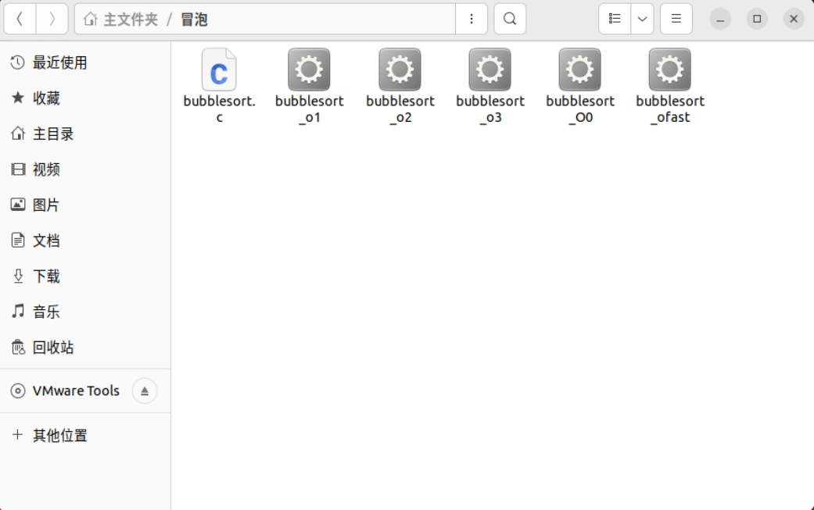

### 二、性能测试
1. 我们可以用如下命令运行文件，以此来记录不同编译优化等级下代码执行时间
```
    time ./filename
```
等待程序运行完毕，出现如图提示：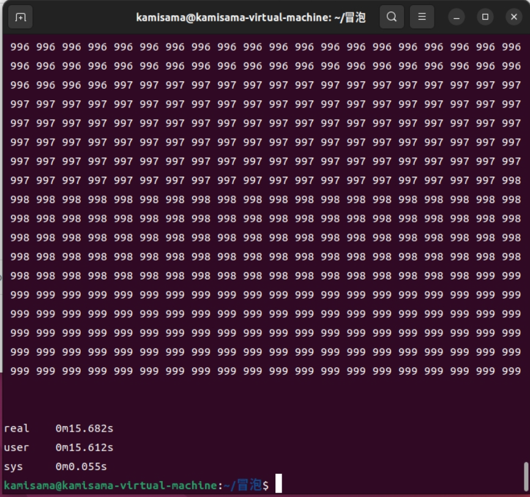
```real```是指程序从开始到结束的总时间，即程序运行的“真实时间”。

```user```是指程序在用户态执行的时间总和，不包括任何操作系统内核的调用。

```sys```是指程序在系统态运行的时间，主要是执行系统调用的时间。

2. 在任务管理器中我们可以看到每个任务对系统资源的占用情况，包括CPU、内存、磁盘I/O、网络等，所以我们可以在终端中输入```top```命令打开任务管理器，如图：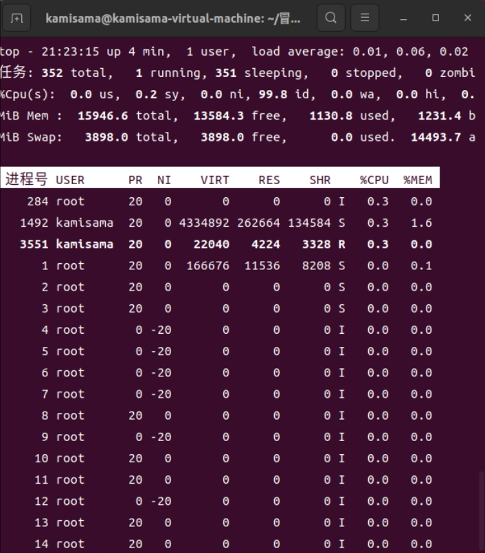

```VIRT```：虚拟内存使用量，表示进程使用的虚拟内存总量，包括已分配的内存，无论是实际使用的还是未被使用的。

```RES```：常驻内存，表示进程实际使用的物理内存量。

```CPU```：即CPU使用率，表示进程占用CPU的百分比。

```MEM```：内存使用率，表示进程使用的物理内存占系统内存的百分比。

3. 但是，在测试基础堆排序和斐波纳契堆排序时会发现程序运行过快，导致我们无法从任务管理器中观察到程序的资源占用情况（任务管理器每隔一秒刷新），所以，我们选择使用```/usr/bin/time -v ./filename```来捕捉运行极快的程序的资源占用情况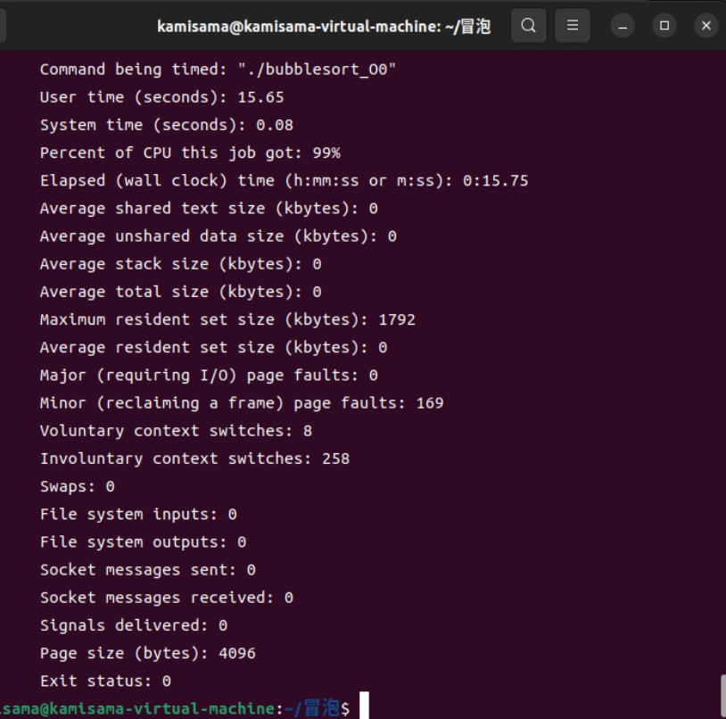
其中包括Elapsed time（程序实际运行时间），maximum resident set size（最大物理内存量）等。

## IV. 数据记录与可视化
### 一、数据记录
为了减小实验误差的影响，提高实验数据的可信度，因此我们对每个算法的每个优化等级都进行3次测试，收集数据结果并求其平均值作为代表，统一记录在[实验数据.csv](https://kdocs.cn/l/csWHoFrJfl7n)文件中,如图：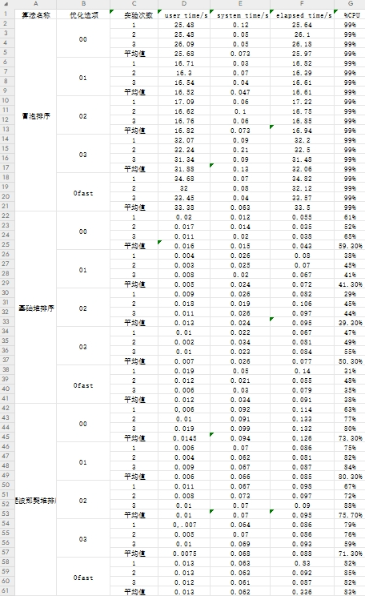

### 二、分析算法的时间复杂度
1. 冒泡排序是通过遍历所有的元素，进行重复交换，这其中会出现很多的无意义比较，也会浪费大量的资源，如果数列已经是有序的，复杂度为O(n)；如果数列是完全逆序的话，时间复杂度就为O($n^2$),即使是一般情况下，时间复杂度依然是O($n^2$)。
2. 基础堆排序是利用堆这种数据结构所设计的一种排序算法，近似于完全二叉树，其构建初始堆的时间复杂度为O(n)，移除元素并进行堆的调整的时间复杂度为O($log$n)，由于堆排序需要重复移除n个元素，因此总的时间复杂度为O(n$log$n)。
3. 斐波那契堆排序的插入、找到最小元素、减小键值以及合并操作的时间复杂度都是O(1)，而删除最小元素涉及到移除最小根节点，将其子节点添加到根列表中，并可能进行树的合并，以保持堆的性质，因此若对n个元素进行排序，则时间复杂度为O(n$log$n)。
4. 由上述分析可知在处理大量数据时，冒泡排序会耗费大量的时间，而堆排序则比冒泡排序快的多。以O0优化等级为例，不同算法的执行时间如下：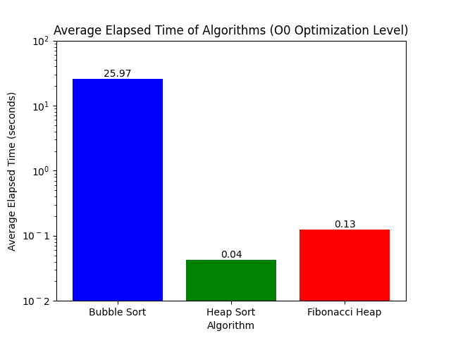
对于不同算法的CPU占用，以O0优化等级为例：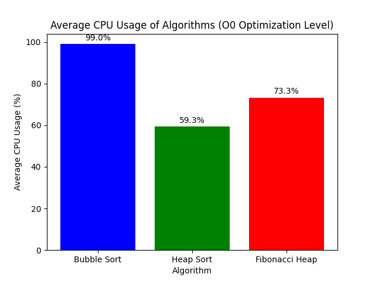综上，堆排序在执行时间和CPU占用等方面都显著优于冒泡排序。而在堆排序中，基础堆排序的在各方面较优于斐波那契堆排序，但这并不说明基础堆排序完全优于斐波那契堆排序，因为斐波那契堆排序在某些情况下可以提供比标准二叉堆更好的性能，尤其是在需要频繁地执行最小值删除操作的场景中。

### 三、不同编译优化等级下的性能对比结果
1. 不同编译等级下执行时间的不同

冒泡排序： 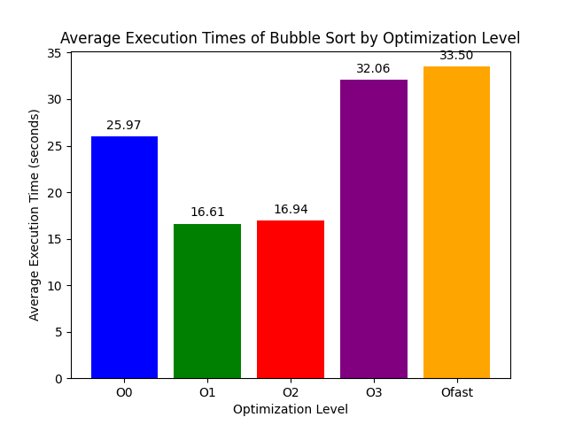

基础堆排序：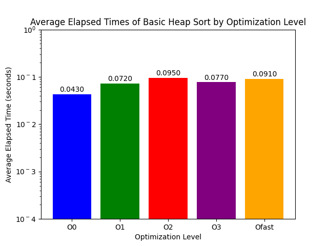

斐波纳契堆排序：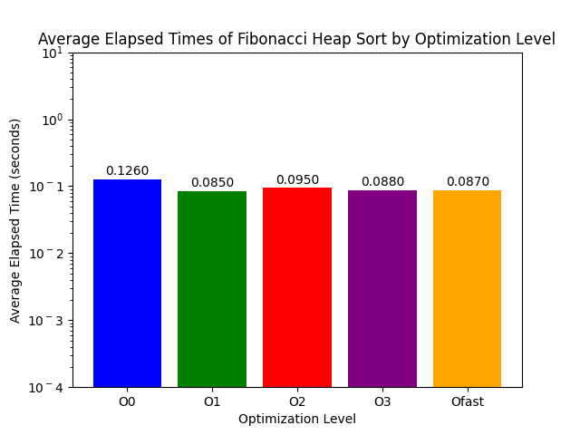

由上三幅图可以看出不同的编译优化选项对于<u>冒泡排序</u>的执行时间影响巨大，O1和O2优化使得执行时间更短，但是O3和Ofast反而使执行时间更长，原因可能是编译器优化的局限性，对于某些算法，尤其是像冒泡排序这样具有高时间复杂度的算法，编译器优化可能难以产生显著的性能提升，甚至可能因为优化过程中引入额外操作而导致性能下降。

对于<u>基础堆排序</u>和<u>斐波那契堆排序</u>，不同的编译优化等级对其执行时间的影响微乎其微，可能是算法原本的性能足够优秀，编译优化对其提升不大。

2. 不同编译等级下CPU占用的不同

冒泡排序：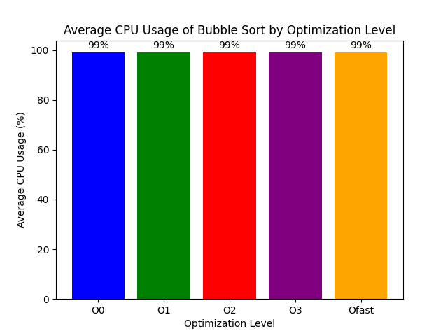

基础堆排序：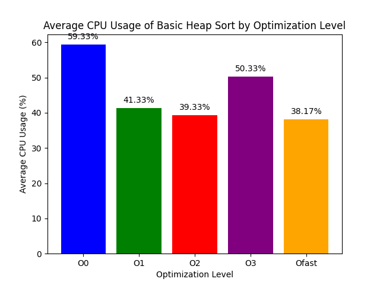

斐波那契堆排序：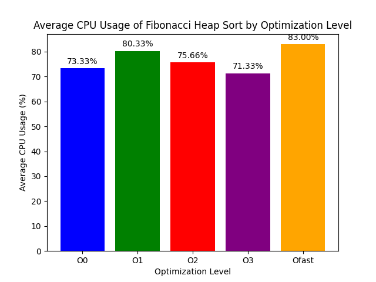

由上三幅图可以看出对于<u>冒泡排序</u>，每个优化等级的CPU占用都为99%，原因应该为冒泡排序本身的资源占用过于巨大，即使编译优化后，依然会占满CPU。

对于基础堆排序，编译优化后确实会减小CPU的占用。

而对于斐波那契堆排序而言，编译优化对于其CPU的占用影响不太明显，可能是因为编译器优化主要针对代码生成和指令调度，但对于斐波那契堆这种复杂的数据结构，编译器可能难以识别和利用其潜在的优化空间。

## V. 实验中遇到的问题及解决办法
1.在刚开始编写代码文件时，由于不怎么熟悉虚拟机以及命令行的使用，导致我连创建一个C语言文件都不会，但是在CSDN上的文章以及kimi的帮助下，才知道可以通过vim创建空文件夹，但是在编辑完后却怎么也找不到文件，对于这个问题，则需要在编辑完成后按```Esc```退出编辑，并输入```：wq```后按回车就可以保存并看到文件了。

2.运行斐波那契堆排序时发生段错误

在编译完成kimi给出的斐波那契堆排序的代码后，运行却被报错<u>发生段错误</u>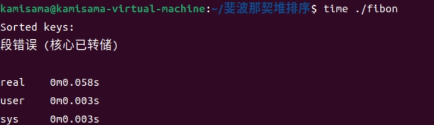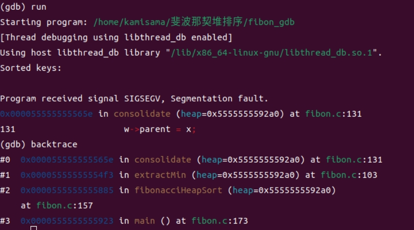反馈给kimi后又看不懂kimi给的解释，在CSDN中搜索也找不到合适的解决办法，在困扰一天后只能求助于交流群里的大家，最终在howthon（浩绪）的帮助下，了解到应该是一个空指针而引发的报错，通过让howthon修改代码解决了报错。


# 最后 特别鸣谢

[kimi](https://kimi.moonshot.cn)

[howthon](https://github.com/HowXu)

相亲相爱的炒蒜队大家庭